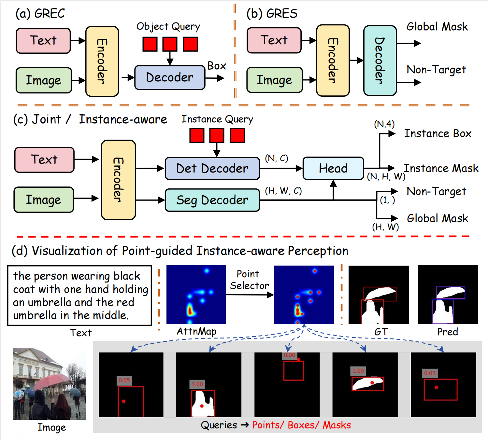

# M2VG

M2VG is a multi-task visual grounding framework for grounding natural-language expressions in images. The codebase supports detection-style grounding, segmentation-style grounding, model training, evaluation, and single-image demo inference.

This repository is prepared as a clean GitHub release version. Large datasets, pretrained weights, checkpoints, logs, and temporary experiment outputs are intentionally excluded from the repository.

## Highlights

- Multi-task visual grounding framework for referring expression understanding.
- Supports box-level and mask-level prediction workflows.
- Config-driven training and evaluation.
- Demo script for image-expression inference.
- Clean package namespace: `m2vg`.

## Framework

<p align="center">
  
</p>

## Repository Structure

```text
M2VG/
|-- asserts/               # Demo images and visual examples
|-- configs/               # Training and evaluation configs
|-- m2vg/                  # Main Python package
|-- tools/                 # Train, test, and demo entry points
|-- data/                  # Dataset placeholder; ignored by Git
|-- pretrain_weights/      # Pretrained backbone placeholder; ignored by Git
|-- work_dir/              # Checkpoint/log placeholder; ignored by Git
|-- requirements.txt
|-- setup.py
`-- README.md
```

## Installation

Recommended environment:

```bash
CUDA == 11.8
torch == 2.0.0
torchvision == 0.15.1
```

Install Python dependencies:

```bash
pip install -r requirements.txt
```

Install external dependencies used by the project:

```bash
python -m pip install 'git+https://github.com/facebookresearch/detectron2.git'
git clone https://github.com/IDEA-Research/detrex.git
cd detrex
git submodule init && git submodule update
pip install -e .
```

Install M2VG in editable mode:

```bash
pip install -e .
```

## Data Preparation

Place datasets under `data/`. The expected layout is:

```text
data/
`-- seqtr_type/
    |-- annotations/
    |   |-- mixed-seg/
    |   |   `-- instances_nogoogle_withid.json
    |   |-- grefs/
    |   |   `-- instance.json
    |   |-- ref-zom/
    |   |   `-- instance.json
    |   `-- rrefcoco/
    |       `-- instance.json
    `-- images/
        `-- mscoco/
            `-- train2014/
```

The `data/` directory is ignored by Git so that large datasets are not uploaded to GitHub.

## Pretrained Weights

Place pretrained backbone files under `pretrain_weights/`:

```text
pretrain_weights/
|-- beit3_base_patch16_224.zip
|-- beit3_large_patch16_224.zip
`-- beit3.spm
```

Place trained M2VG checkpoints under `work_dir/` or pass their paths directly with `--load-from` or `--checkpoint`.

## Demo

GRES example:

```bash
python tools/demo.py \
  --img "asserts/imgs/Figure_1.jpg" \
  --expression "three skateboard guys" \
  --config "configs/gres/M2VG-grefcoco.py" \
  --checkpoint /PATH/TO/M2VG-grefcoco.pth
```

RefCOCO example:

```bash
python tools/demo.py \
  --img "asserts/imgs/Figure_2.jpg" \
  --expression "full half fruit" \
  --config "configs/refcoco/M2VG-B-refcoco/M2VG-B-refcoco.py" \
  --checkpoint /PATH/TO/M2VG-B-refcoco.pth
```

## Training

```bash
bash tools/dist_train.sh [PATH_TO_CONFIG] [NUM_GPUS]
```

Example:

```bash
bash tools/dist_train.sh configs/gres/M2VG-grefcoco.py 1
```

## Evaluation

```bash
bash tools/dist_test.sh [PATH_TO_CONFIG] [NUM_GPUS] \
  --load-from [PATH_TO_CHECKPOINT_FILE]
```

Example:

```bash
bash tools/dist_test.sh configs/refcoco/M2VG-B-refcoco/M2VG-B-refcoco.py 1 \
  --load-from work_dir/refcoco/M2VG-B-refcoco.pth
```

## Available Configs

| Task | Config |
| --- | --- |
| gRefCOCO | `configs/gres/M2VG-grefcoco.py` |
| RefCOCO Base | `configs/refcoco/M2VG-B-refcoco/M2VG-B-refcoco.py` |
| RefCOCO Large | `configs/refcoco/M2VG-L-refcoco/M2VG-L-refcoco.py` |
| Ref-ZOM | `configs/refzom/M2VG-refzom.py` |
| RRefCOCO | `configs/rrefcoco/M2VG-rrefcoco.py` |

## Notes for GitHub Upload

The following files and directories are ignored by `.gitignore`:

- Datasets: `data/`
- Pretrained weights: `pretrain_weights/`
- Training outputs and checkpoints: `work_dir/`, `outputs/`, `output/`
- Python caches and temporary files
- Large archives and model files such as `.pth`, `.pt`, `.ckpt`, `.zip`, and `.tar`

This keeps the repository lightweight and suitable for GitHub.

## Acknowledgements

This project uses components from:

- [Detectron2](https://github.com/facebookresearch/detectron2)
- [Detrex](https://github.com/IDEA-Research/detrex)
- [BEiT-3](https://github.com/microsoft/unilm/tree/master/beit3)

## License

See [LICENSE.txt](./LICENSE.txt).
